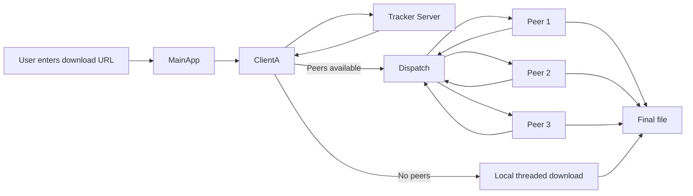
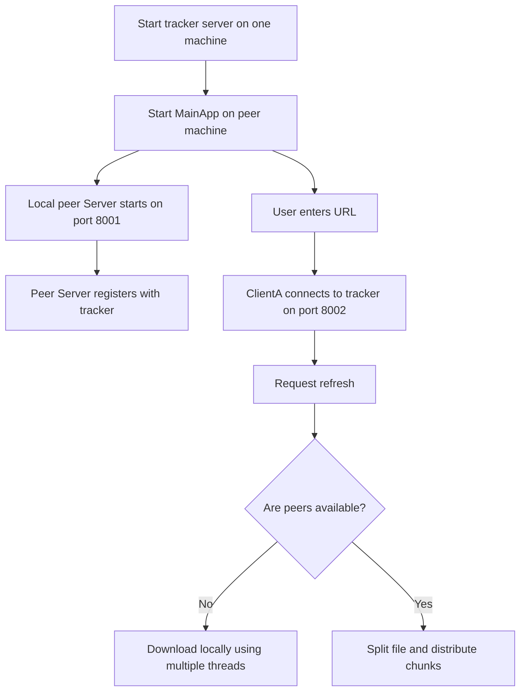
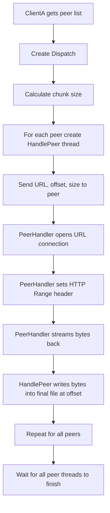
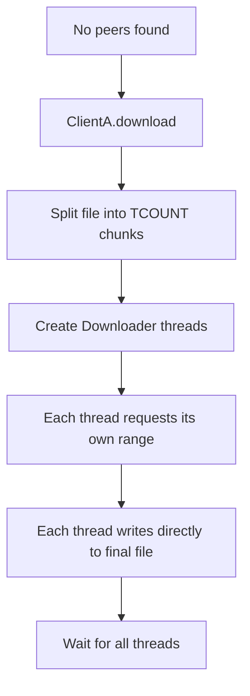
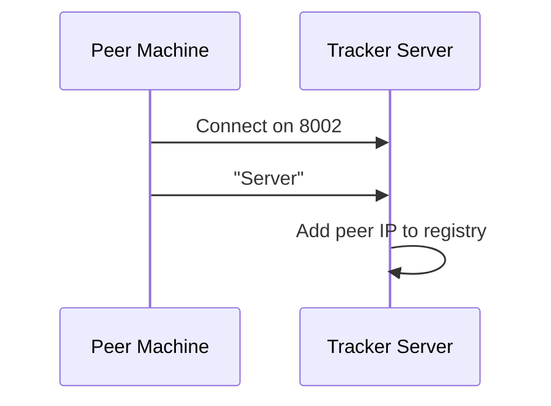
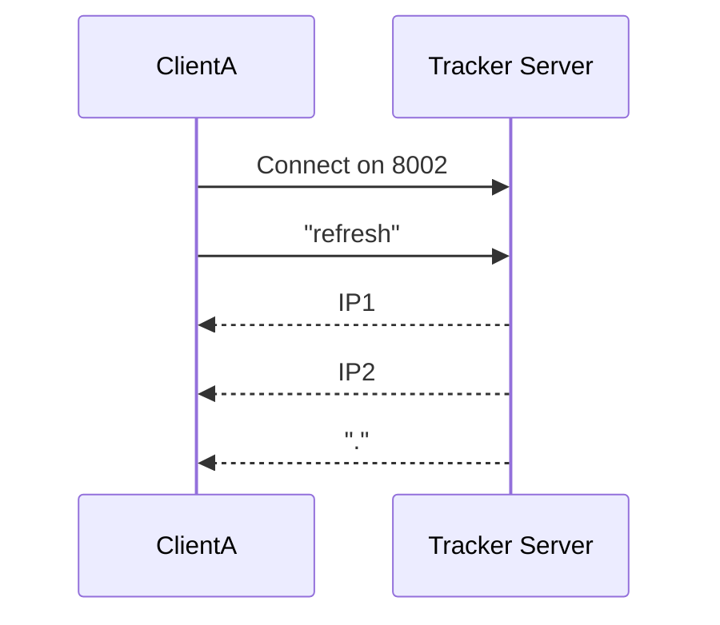
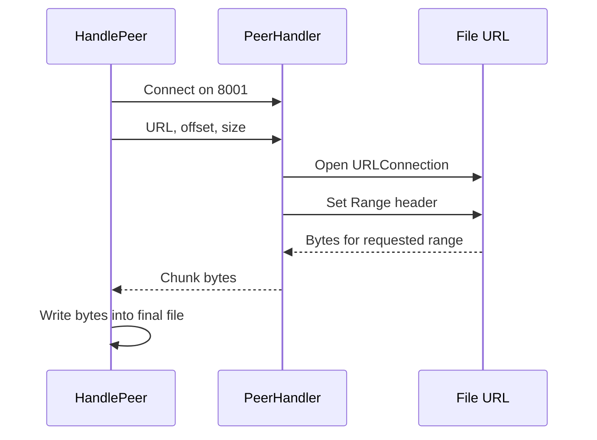

# DISTRIBYTE / Distributed Download Manager Documentation

## 1. Project Overview

DISTRIBYTE is a Java-based distributed download manager. Its purpose is to split a large file download across multiple machines on the same network so the load does not depend on a single computer or a single internet connection.

The design is simple:

- One machine runs the tracker server.
- Every participating machine runs the main application.
- Each machine registers itself with the tracker as a peer server.
- When a user enters a URL, the client asks the tracker for online peers.
- If peers exist, the download is distributed.
- If no peers are available, the current machine downloads the file locally using multiple threads.

This project is best understood as a small peer-assisted downloader with a central coordinator.

## 2. What Problem It Solves

Large downloads are expensive when only one machine performs all the work. DISTRIBYTE tries to improve throughput by:

- splitting the file into chunks,
- assigning chunks to different peers,
- letting each peer fetch its assigned range,
- writing the received bytes directly into the final file at the correct offset.

This is useful in LAN or hotspot-style environments where machines can communicate with low latency.

## 3. High-Level Architecture

There are two runtime roles and one coordination service.



### Main parts

- `APP/MainApp.java` starts the peer server and then starts the client download flow.
- `APP/server.java` contains the peer server and peer-side request handler.
- `APP/downloader.java` contains the client-side download logic and the dispatch logic.
- `TRACKER/server.java` contains the tracker server, request handler, and the shared peer registry.
- `APP/INTF/*.java` contains interfaces used by the client and dispatch objects.

## 4. Folder and File Roles

### `APP/MainApp.java`
This is the application entry point for the peer machine. It:

- starts the local peer server,
- prompts the user for a download URL,
- creates a client object for the download,
- waits for both background threads to finish.

### `APP/server.java`
This file defines two key runtime pieces:

- `PeerHandler`, which serves file bytes to other peers,
- `Server`, which listens on port `8001` and registers itself with the tracker.

### `APP/downloader.java`
This file defines the client-side logic:

- `HandlePeer`, which connects to another peer and receives a chunk,
- `Dispatch`, which splits the file among peers,
- `Downloader`, which downloads a chunk directly from the URL on the local machine,
- `ClientA`, which decides whether to distribute or download locally.

### `APP/INTF/Dispatcher.java`
Interface for the dispatch layer.

### `APP/INTF/Client.java`
Interface for the main client behavior.

### `APP/INTF/Reciever.java`
A placeholder interface. It is currently not used by the runtime flow.

### `APP/INTF/assembler.java`
Another placeholder interface. It is currently empty and unused.

### `TRACKER/server.java`
This is the tracker service. It:

- accepts peer registrations,
- stores a list of online peers,
- returns the current list to clients,
- removes peers when they disconnect.

## 5. Runtime Roles

## 5.1 Tracker

The tracker is the central coordination point.

Responsibilities:

- maintain the list of online peer IPs,
- answer peer-refresh requests,
- remove disconnected peers,
- provide service on port `8002`.

It does not move file data. It only manages discovery.

### Tracker protocol

The tracker understands these text commands:

- `Server` - register the connecting machine as a download-capable peer,
- `refresh` - return the current peer list,
- `disconnect` - remove the peer and close the connection.

The tracker writes peer IPs one per line and uses `.` as the end marker.

## 5.2 Peer Server

Every machine running the application also opens a peer server on port `8001`.

Responsibilities:

- accept chunk requests from other peers,
- read the requested byte range from the remote URL,
- stream those bytes back to the requesting peer.

This is the machine that acts as a mini source node for the distributed download.

## 5.3 Client

The client is the download controller.

Responsibilities:

- connect to the tracker,
- ask for available peers,
- decide whether to distribute or download locally,
- compute the filename,
- manage thread creation and completion.

## 6. End-to-End Flow

## 6.1 Startup Flow



## 6.2 Distributed Download Flow



## 6.3 Local Download Flow



## 7. Detailed Class-by-Class Explanation

## 7.1 `MainApp`

File: `APP/MainApp.java`

MainApp is only a bootstrapper.

Sequence:

1. Create the local peer server object.
2. Read a URL from standard input.
3. Create a client controller for that URL.
4. Wait for the server and client threads to complete.

Important point: the peer server starts before the client asks for peer discovery, so the machine can immediately participate in other downloads.

## 7.2 `Server` in `APP/server.java`

This is the peer-side server.

Important fields:

- `PEER_SERVER_PORT = 8001`
- `TRACKER_PORT = 8002`
- `TRACKER_IP = "127.0.0.1"` in the current source

Behavior:

- opens a `ServerSocket` on port `8001`,
- connects to the tracker on port `8002`,
- sends the text `Server` to register itself,
- stays in an accept loop,
- creates a new `PeerHandler` for each incoming peer connection.

### `PeerHandler`

This class serves chunk data to another peer.

What it receives from the requesting peer:

- URL of the file,
- offset from which to start,
- size of the chunk.

What it does:

- opens the remote URL,
- sets `Range: bytes=<offset>-`,
- reads the requested bytes,
- writes them to the socket output stream,
- closes the connection when done.

This is the key transfer mechanism that makes the project distributed.

## 7.3 `ClientA` in `APP/downloader.java`

This is the main client controller.

Important fields:

- `TCOUNT = 4` for local threaded downloads,
- `TRACKER_PORT = 8002`,
- `TRACKER_IP = "127.0.0.1"` in the current source,
- `NODE_CHUNK = 1000000` is present but not used in the current flow.

### Constructor

The constructor:

- connects to the tracker,
- stores the URL,
- opens a URL connection to determine file size,
- generates a safe local filename,
- starts the client thread.

### `checkPeers()`

This method:

- sends `refresh` to the tracker,
- reads IP addresses line by line,
- stops when it receives `.`,
- stores unique peer IPs in a `HashSet`,
- returns `true` if more than one peer is available.

Why more than one?

The code is written so that a single-machine setup still works. If the set contains only the local machine, it falls back to local download.

### `run()`

The main decision point:

- if no peers are found, call `download()` and then disconnect from the tracker,
- if peers exist, create a `Dispatch` object and distribute the file.

### `download()`

This is the local fallback path.

It:

- splits the file into four chunks,
- creates a `Downloader` thread per chunk,
- waits for all chunk threads to finish.

### `getFileName()`

This helper:

- extracts the file name from the URL path,
- falls back to `download` if no name exists,
- adds `(1)`, `(2)`, and so on if a file already exists locally.

That prevents overwriting an existing file with the same name.

## 7.4 `Dispatch` in `APP/downloader.java`

This class handles distributed chunk assignment.

Behavior:

- receives the peer IP list, URL, file size, and filename,
- calculates a chunk size based on the number of peers,
- creates one `HandlePeer` worker per peer,
- waits for all workers to finish.

The current chunk formula is:

```text
chunk = (size / ipList.size()) + 1
```

The code then assigns ranges sequentially using `offset += chunk`.

## 7.5 `HandlePeer`

This worker is the client-side receiver for one peer chunk.

Behavior:

1. Connect to a peer server on port `8001`.
2. Open the final file using `RandomAccessFile`.
3. Send the URL, offset, and chunk size to the peer.
4. Seek to the offset in the output file.
5. Read bytes from the peer socket.
6. Write those bytes at the correct position in the file.

This design allows multiple peers to fill different parts of the same file concurrently.

## 7.6 `Downloader`

This is the local-machine chunk downloader.

Behavior:

- set a `Range` header on the URL connection,
- seek to the correct offset in the file,
- read a chunk of bytes,
- write them into the file.

The implementation is similar to `HandlePeer`, but instead of reading from a peer socket it reads directly from the remote URL.

## 7.7 Tracker Classes in `TRACKER/server.java`

### `Tracker`

This object stores online peers in a `HashSet<String>`.

Methods:

- `add(String ip)` adds a peer,
- `refresh(PrintWriter os)` streams the current peer list to the requester,
- `delete(String ip)` removes a peer.

### `Handler`

This is the per-connection tracker worker.

It reads incoming text commands and routes them:

- `Server` -> add the peer IP,
- `refresh` -> send the peer list back,
- `disconnect` -> close the session.

### tracker `Server`

This is the tracker process entry point.

It listens on port `8002`, accepts incoming sockets, and creates a new `Handler` per connection.

## 8. Data Flow

## 8.1 Registration Flow



## 8.2 Peer Discovery Flow



## 8.3 Chunk Fetch Flow



## 9. Important Technical Concepts Used

### Multithreading

The project uses a thread per major activity:

- one thread for the tracker/peer server,
- one thread for the client controller,
- one thread per downloaded chunk,
- one thread per inbound peer request.

### Random access file writing

`RandomAccessFile` is used so each chunk can be written directly into the correct byte position without waiting for the previous chunk.

### HTTP range requests

The code relies on the server supporting the `Range` header. That allows partial download of a file instead of fetching the whole file every time.

### Socket-based peer communication

Peers exchange simple line-based messages over sockets. The tracker and peer-to-peer paths are both built on Java networking classes.

## 10. Current Limitations and Observations

These are important to know for placements because they show that you understand both the idea and the implementation gaps.

- The tracker IP is hardcoded in the source.
- The project assumes a LAN or hotspot-style environment.
- There is limited fault tolerance if a peer disconnects during transfer.
- There is no retry logic for failed chunks.
- Load balancing is basic; peers are assigned chunks evenly by count, not by capacity.
- The chunk size logic may produce uneven splits.
- Some interfaces in `APP/INTF` are placeholders and are not fully used.
- The tracker currently only stores IP addresses, not richer peer metadata.
- The code is very prototype-like and is best described as a proof of concept.

## 11. How to Explain This Project in an Interview

A clean placement-ready explanation is:

"DISTRIBYTE is a distributed download manager written in Java. A central tracker keeps track of online peers. When a user gives a URL, the client asks the tracker for active peers. If peers are available, the file is split into chunks and each peer downloads a different byte range. Each peer writes its chunk into the correct offset of the final file using RandomAccessFile. If no peers are available, the current machine falls back to a local threaded download."

If asked about the key technical topics, mention:

- multithreading,
- client-server networking,
- peer discovery,
- byte-range downloads,
- concurrent file writes,
- distributed work splitting.

## 12. Suggested Improvements

If you want to strengthen this project for placements, the most useful upgrades would be:

- remove hardcoded IPs and read them from config,
- add retry and resume support,
- store peer health and bandwidth info in the tracker,
- balance chunks based on peer performance,
- verify file integrity after download,
- improve logs and error handling,
- convert the prototype interfaces into a cleaner architecture.

## 13. Quick Run Summary

1. Start the tracker server from `TRACKER/server.java`.
2. Start `APP/MainApp.java` on each peer machine.
3. Ensure each peer can reach the tracker on port `8002`.
4. Enter a file URL in the main app.
5. The client either downloads locally or distributes the work across peers.

## 14. Source Mapping

- Entry point: `APP/MainApp.java`
- Peer server: `APP/server.java`
- Client and dispatch logic: `APP/downloader.java`
- Tracker: `TRACKER/server.java`
- Interfaces: `APP/INTF/*.java`

## 15. Final Notes

This repository is a functional academic-style prototype. Its real value for placements is in the networking and concurrency story, not in production-grade reliability.

If you explain it clearly, the strongest points are:

- you used a tracker-based distributed architecture,
- you split a file into chunks,
- you used sockets for peer communication,
- you used `RandomAccessFile` for concurrent writes,
- you provided a local fallback path when peers are unavailable.
